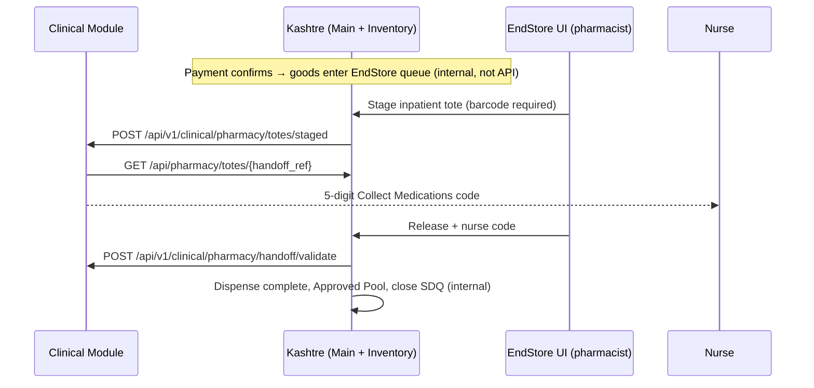

# Kashtre Inventory ↔ Clinical integration

Shareable reference for teams wiring **Clinical Module** to **Kashtre** (Main + Inventory / EndStore).

**Source of truth in code:** `routes/api.php`, `ClinicalIntegrationController`, `ClinicalModuleIntegrationService`.

**SRD:** *KashTre Inventory Endstore Systems Requirements Document* V6.0 — §4.5 ward handoff, §8 cross-module sync.

---

## Architecture (simple)



| Layer | Integration style |
|-------|-------------------|
| **Clinical ↔ Kashtre** | HTTP REST + API keys (this document) |
| **Billing / Main Module** | **Inside Kashtre** (invoices, service queue) — no separate billing API |
| **Dispense, usage, crash carts** | **Kashtre web UI** — not exposed as public Inventory REST |

---

## Configuration (Kashtre admin)

**UI:** Settings → **Clinical Module Settings** (`/settings/clinical-module`)

| Setting | Purpose |
|---------|---------|
| **Clinical Module URL** | Base URL Kashtre calls for outbound requests |
| **Outbound service key** | Sent as `X-Service-Key` on outbound calls to Clinical |
| **Inbound API key** | Clinical must send this on inbound calls to Kashtre |
| **Encounter webhook** | When enabled, Kashtre notifies Clinical on new visit/encounter |

**Optional env seeds** (UI overrides): `CLINICAL_MODULE_URL`, `CLINICAL_MODULE_SERVICE_KEY`, `CLINICAL_MODULE_INBOUND_API_KEY`, `CLINICAL_MODULE_ENCOUNTER_WEBHOOK_ENABLED`

---

## Authentication & tenancy

### Inbound (Clinical → Kashtre)

| Header | Required |
|--------|----------|
| `X-Service-Key` **or** `X-API-Key` | Yes — must match **Inbound API key** |
| `X-Tenant-Id` | Optional — business scope |
| `Accept: application/json` | Recommended |

**Tenant ID** (`tenant_id` query param or `X-Tenant-Id`): business numeric `id`, business `uuid`, or `entity_code`.

**401:** `{ "error": "Unauthorized" }`

### Outbound (Kashtre → Clinical)

| Header | Value |
|--------|--------|
| `X-Service-Key` | Outbound service key from settings |
| `X-Tenant-Id` | Business id (string) when available |
| `Accept` | `application/json` |
| Body | `application/json` |

Timeout: **15 seconds**.

---

## APIs Kashtre exposes (Clinical calls these)

**Base:** `https://<kashtre-host>/api`

All successful responses use a top-level `data` object unless noted.

### 1. Search catalogue

```http
GET /api/catalogue/items?q=paracetamol&tenant_id={business_uuid}
X-API-Key: {inbound_key}
```

| Query | Required | Description |
|-------|----------|-------------|
| `q` | Yes | Search term (name, generic, code) |
| `tenant_id` | Recommended | Business scope |

**422** if `q` is missing.

**Example `data` item:**

```json
{
  "sku": "MED-001",
  "item_name": "Paracetamol 500mg",
  "alternative_names": ["Acetaminophen"],
  "strength_descriptor": "500mg",
  "is_offer_item": false,
  "service_code": null,
  "drug_code": "PARACETAMOL",
  "ingredient_codes": ["PARACETAMOL"],
  "drug_class_codes": [],
  "uuid": "...",
  "type": "good",
  "business_id": 1
}
```

---

### 2. Client / patient lookup

```http
GET /api/clients/{id}?tenant_id={business_uuid}
X-API-Key: {inbound_key}
```

`{id}`: client `uuid`, permanent `client_id`, or numeric `id`.

**404:** `{ "message": "Client not found." }`

**Example `data`:**

```json
{
  "global_client_id": "uuid",
  "client_code": "CL-000123",
  "full_name": "Jane Doe",
  "date_of_birth": "1990-01-15",
  "gender": "female",
  "phone": "+256...",
  "visit_id": "V-20260812-0042",
  "visit_expires_at": "2026-08-12T21:00:00+00:00",
  "business_id": 1,
  "branch_id": 2,
  "business": { "id": 1, "uuid": "...", "name": "..." },
  "branch": { "id": 2, "uuid": "...", "name": "..." }
}
```

---

### 3. Service queues

```http
GET /api/queues?tenant_id={business_uuid}&ward_code=WARD_A
X-API-Key: {inbound_key}
```

Returns pending / in-progress service delivery rows (Main Module queues), optionally filtered by `ward_code` (slug match on room name).

**Example `data` row:**

```json
{
  "queue_code": "service-point-uuid",
  "queue_name": "Triage",
  "global_client_id": "uuid",
  "client_code": "CL-000123",
  "visit_id": "V-...",
  "ward_code": "WARD_A",
  "ward_name": "Ward A",
  "item_name": "Consultation",
  "status": "pending",
  "waiting_since": "2026-08-12T08:00:00+00:00",
  "business_id": 1,
  "branch_id": 2
}
```

---

### 4. Clinical events (inbound facts)

```http
POST /api/events
X-API-Key: {inbound_key}
Content-Type: application/json
```

**Supported today:** `fact_token: "INFANT_REGISTRATION"`

```json
{
  "event_id": "unique-idempotency-key",
  "fact_token": "INFANT_REGISTRATION",
  "tenant_id": "business-uuid",
  "mother_patient_id": "mother-uuid-or-client_id",
  "sex": "MALE",
  "delivery_at": "2026-08-12T10:30:00+00:00",
  "birth_order": 1,
  "inherit_maternal_coverage": true,
  "birth_record_id": "optional-clinical-ref",
  "callback_path": "/api/v1/clinical/.../optional-callback"
}
```

**201 `data`:**

```json
{
  "status": "registered",
  "infant_patient_id": "uuid",
  "infant_visit_id": "V-...",
  "client_code": "CL-..."
}
```

Duplicate `event_id` returns the stored response (idempotent).

**422:** missing `event_id` or unsupported `fact_token`.  
**404:** mother not found.

---

### 5. Staged tote checklist (End Store §4.5)

Used when the ward opens **Collect Medications** for a staged handoff.

```http
GET /api/pharmacy/totes/{handoff_ref}?tenant_id={business_uuid}
X-API-Key: {inbound_key}
```

`handoff_ref` = `InventoryHandoffToken.uuid` (returned when pharmacist stages in EndStore).

**404:** `{ "message": "Tote / handoff session not found." }`

**Example `data`:**

```json
{
  "handoff_ref": "550e8400-e29b-41d4-a716-446655440000",
  "clinical_session_id": null,
  "expires_at": "2026-08-12T12:00:00+00:00",
  "business_id": 1,
  "store": { "id": 5, "uuid": "...", "name": "Pharmacy End Store" },
  "basket_key": "client-42-visit-...",
  "tote_barcode": "TOTE-8842",
  "lines": [
    {
      "fulfillment_line_uuid": "...",
      "fulfillment_line_id": 101,
      "global_client_id": "uuid",
      "client_code": "CL-000123",
      "client_name": "Jane Doe",
      "visit_id": "V-...",
      "sku": "MED-001",
      "item_uuid": "...",
      "item_name": "Ceftriaxone 1g",
      "strength": "1g",
      "quantity": 2,
      "status": "staged"
    }
  ]
}
```

---

## APIs Clinical must expose (Kashtre calls these)

**Base:** `{CLINICAL_MODULE_URL}` from Kashtre settings.

### A. Tote staged alert — §4.5 step 1

```http
POST /api/v1/clinical/pharmacy/totes/staged
X-Service-Key: {outbound_key}
X-Tenant-Id: {business_id}
Content-Type: application/json
```

**Body:** same shape as [§5 tote checklist](#5-staged-tote-checklist-end-store-45) `data` above.

**Expected response (flexible):**

```json
{
  "clinical_session_id": "optional-session-id"
}
```

or

```json
{
  "data": { "clinical_session_id": "..." }
}
```

Kashtre stores `clinical_session_id` on the handoff token for validate.

---

### B. Handoff code validation — §4.5 step 4

```http
POST /api/v1/clinical/pharmacy/handoff/validate
X-Service-Key: {outbound_key}
Content-Type: application/json
```

**Request:**

```json
{
  "code": "12345",
  "handoff_ref": "550e8400-e29b-41d4-a716-446655440000",
  "clinical_session_id": "optional",
  "store_id": 5,
  "store_uuid": "...",
  "basket_key": "...",
  "business_id": 1
}
```

**Success response:**

```json
{
  "valid": true,
  "clinical_session_id": "..."
}
```

or `{ "data": { "valid": true, ... } }`

**Failure:** HTTP 4xx or `{ "valid": false, "message": "..." }`

If Clinical is **not configured**, Kashtre **fails closed** — Release is blocked in EndStore.

---

### C. Encounter created (optional)

```http
POST /api/v1/clinical/encounters/created
X-Service-Key: {outbound_key}
```

**Body:**

```json
{
  "global_client_id": "client-uuid",
  "visit_id": "V-...",
  "previous_visit_id": "V-...",
  "business_id": 1,
  "branch_id": 2
}
```

Sent when a client receives a new visit id (if encounter webhook enabled).

---

## End Store workflow (what is **not** an API)

These run in the **Kashtre browser UI** (Inventory → **EndStore**):

| Step | Who | Action |
|------|-----|--------|
| 1 | Cashier / Main | Patient pays for **goods** (`item.type = good`) |
| 2 | System | Queue line appears on selected/default End Store with OP or IP strategy from POS or store defaults |
| 3a OP | Pharmacist | **Dispense** — stock ↓, Approved Pool ↑ (when enabled on the line), ticket Completed |
| 3b IP | Pharmacist | **Stage** (tote barcode) → Clinical alert → nurse code → **Release** |
| 4 | Ward | **Record Usage** — pool / floor / admin / crash cart |

**Crash carts** are not part of the EndStore pay→queue path. They are **satellite stores** under an End Store with role **Crash cart** (Ready → Deploy → Reconcile → Seal). Usage is recorded on the ward; Seal Ready drafts an internal replenishment from the parent End Store. They do not use Approved Pool from dispense.

**Prerequisites in Kashtre:**

1. Inventory module active for the business  
2. Store hierarchy: Distribution → **End Store** → Satellite (optional; crash cart = satellite role)  
3. At least one End Store for the business/branch  
4. Stock on the End Store  
5. Clinical settings configured for IP handoff  

Manual test checklist: `tests/Feature/Inventory/ENDSTORE_SRD_SMOKE_CHECKLIST.md`

---

## Quick curl smoke tests

Replace host, keys, and ids.

```bash
# Catalogue
curl -sS -H "X-API-Key: YOUR_INBOUND_KEY" \
  "https://kashtre.example.com/api/catalogue/items?q=para&tenant_id=BUSINESS_UUID"

# Client
curl -sS -H "X-API-Key: YOUR_INBOUND_KEY" \
  "https://kashtre.example.com/api/clients/CLIENT_UUID?tenant_id=BUSINESS_UUID"

# Tote checklist (after staging in EndStore UI)
curl -sS -H "X-API-Key: YOUR_INBOUND_KEY" \
  "https://kashtre.example.com/api/pharmacy/totes/HANDOFF_REF?tenant_id=BUSINESS_UUID"
```

---

## Version & support

| Item | Value |
|------|--------|
| Kashtre branch (day-to-day) | `demo` |
| API routes file | `routes/api.php` |
| Clinical controller | `app/Http/Controllers/API/ClinicalIntegrationController.php` |
| Integration service | `app/Services/ClinicalModuleIntegrationService.php` |
| EndStore UI | `/inventory/fulfillment` |

For questions about **dispense rules, Approved Pool, or crash carts**, refer to the Endstore SRD V6.0 and the smoke checklist above.

---

## Summary for integrators

1. **You implement on Clinical:** `totes/staged`, `handoff/validate`, (optional) `encounters/created`.  
2. **You call on Kashtre:** catalogue, clients, queues, events, **pharmacy/totes/{ref}**.  
3. **You do not call** dispense/stage/release APIs — pharmacists use **EndStore** in Kashtre.  
4. **Billing** is internal to Kashtre — no external Main Module webhook URL.
